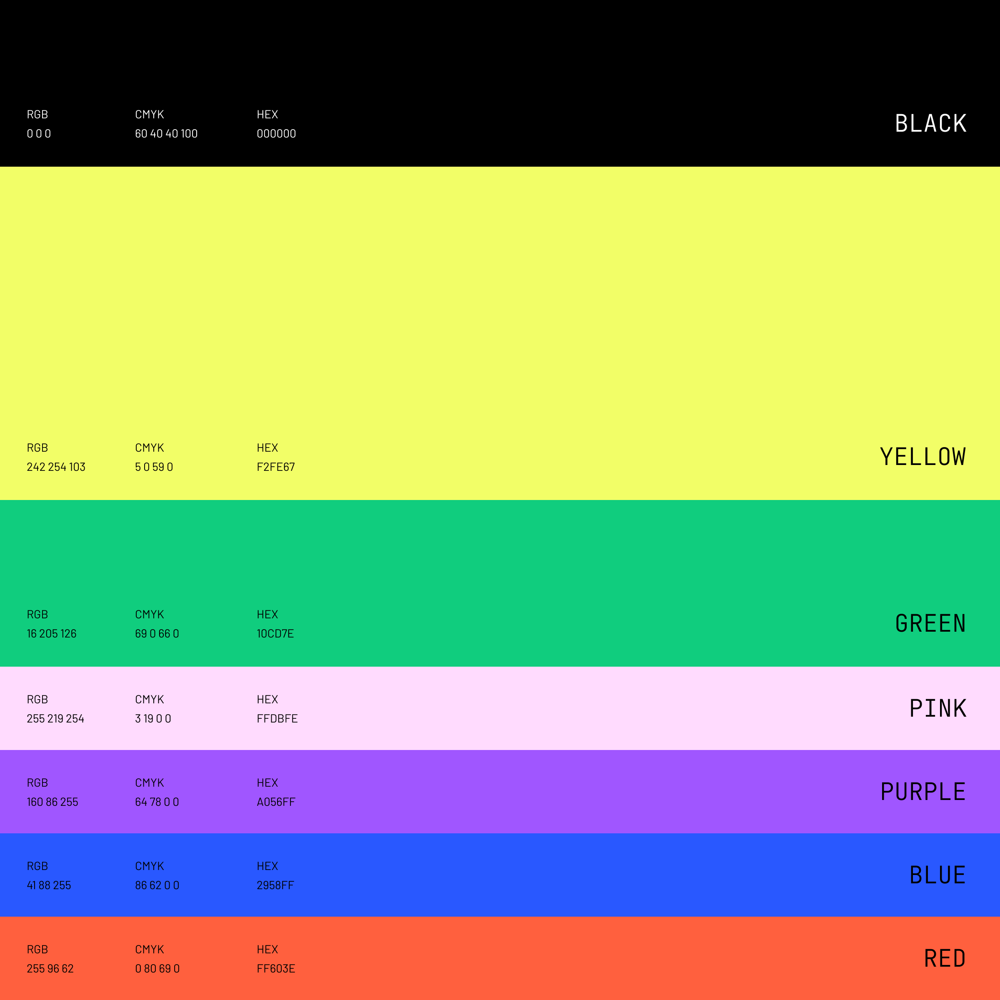

# Color Palette
 

## Main Color

| Color | HEX | RGBA | CMYK |
| ----------- | ----------- |
|  | `#F2FE67` | `rgba(242, 254, 103, 1)` | `5 0 59 0` |

The main and constant color of Tinyman brandy is yellow. In the images and visuals that will be created outside of Tinyman platform, this yellow color should have priority over other colors on palette.

## Secondary Colors

| Color | HEX | RGBA | CMYK |
| ----------- | ----------- |
|  | `#000000` | `rgba(0, 0, 0, 1)` | `60 40 40 100` |
|  | `#10CD7E` | `rgba(16, 205, 126, 1)` | `69 0 66 0` |
|  | `#10CD7E` | `rgba(255, 219, 254, 1)` | `3 19 0 0` |
|  | `#10CD7E` | `rgba(160, 86, 255, 1)` | `64 78 0 0` |
|  | `#10CD7E` | `rgba(41, 88, 255, 1)` | `86 62 0 0` |
|  | `#10CD7E` | `rgba(255, 96, 62, 1)` | `0 80 69 0` |
These are the secondary colors in addition to the primary color yellow. These and the tones of these colors can be used as supporting colors while creating any visual asset.

## Gradient Palette

| Gradient | Description | HEX | linear-gradient |
| ----------- | ----------- |
|  | Green to yellow | `#10CD7E` to `#F2FE67`  | `linear-gradient(180deg, #10CD7E 0%, #F2FE67 100%)`|
|  | Green to pink | `#10CD7E` to `#FFDBFE` | `linear-gradient(180deg, #10CD7E 0%, #FFDBFE 100%)` |
|  | Blue to pink | `#10CD7E` to `#FFDBFE` | `linear-gradient(180deg, #2958FF 0%, #FFDBFE 100%)` |
|  | Purple to pink | `#10CD7E` to `#FFDBFE` | `linear-gradient(180deg, #A056FF 0%, #FFDBFE 100%)` |
|  | Red to pink | `#10CD7E` to `#FFDBFE` | `linear-gradient(180deg, #FF603E 0%, #FFDBFE 100%)` |

While creating a visual or especially an illustration about Tinyman, these gradients can be used. And also, this palette can be expanded by using more complex gradients by using the colors in the color palette.